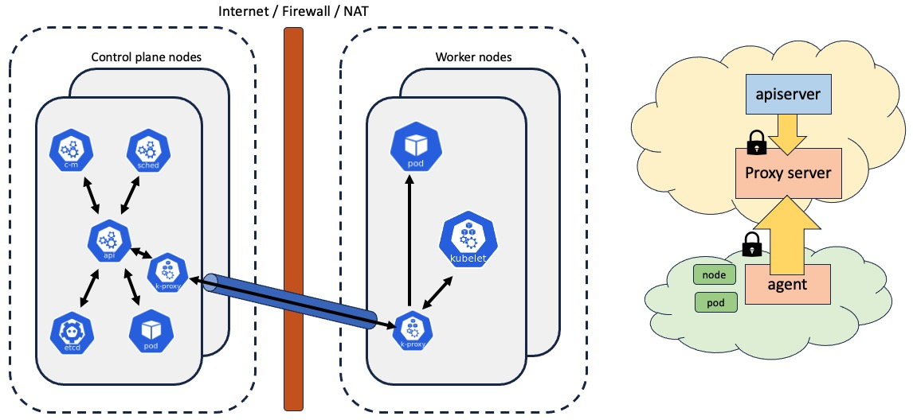

# K8s Konnectivity

<p align="center"> 
<!-- join kubernetes slack channel for linode -->
<a href="https://kubernetes.slack.com/messages/CD4B15LUR">
</a>
<!-- PRs welcome -->
<a href="http://makeapullrequest.com">
</a>
</p>

------

## Purpose
[Konnectivity](https://kubernetes.io/docs/tasks/extend-kubernetes/setup-konnectivity/) is a TCP level forward proxy for routing network communication from k8s-apiserver to the cluster network. It uses server and agent topology. Konnectivity-agent connects to konnectivity-server and creates tunnel which is then used for sending requests to cluster resources.

------

## Overall workflow


------

## Installation

###  Install the konnectivity helm repo
```
helm repo add konnectivity https://linode.github.io/konnectivity/
helm repo update konnectivity
```

### Deploy konnectivity
Konnectivity runs on control-plane nodes. Worker nodes should be able to reach to konnectivity-server over the network. Set `proxyServerHost` to the ip-address using which one can reach to konnectivity-server. By  default, it uses port 8132. If running a HA cluster, make sure to also set `serverCount` so that connections are formed to all konnectivity-servers running in the cluster.

#### Prepare the control plane nodes
Add egress-selector-configuration file on nodes where apiserver is running.
```
curl -s -L https://raw.githubusercontent.com/linode/konnectivity/main/config/egress-selector-configuration.yaml > /etc/kubernetes/konnectivity/egress-selector-configuration.yaml
```

#### Generate kubeconfig used by konnectivity
```
curl -s -L https://raw.githubusercontent.com/linode/konnectivity/main/scripts/gen-konnectivity-kubeconfig.sh | bash
```

#### Deploy helm chart
```
helm install konnectivity --set proxyServerHost=<control-plane-ip> konnectivity/konnectivity
```

------

## Contribution Guidelines
Want to improve the konnectivity? Please start [here](.github/CONTRIBUTING.md).

## Join the Kubernetes Community
For general help or discussion, join us in #linode on the [Kubernetes Slack](https://kubernetes.slack.com/messages/CD4B15LUR/details/). To sign up, use the [Kubernetes Slack inviter](http://slack.kubernetes.io/).
